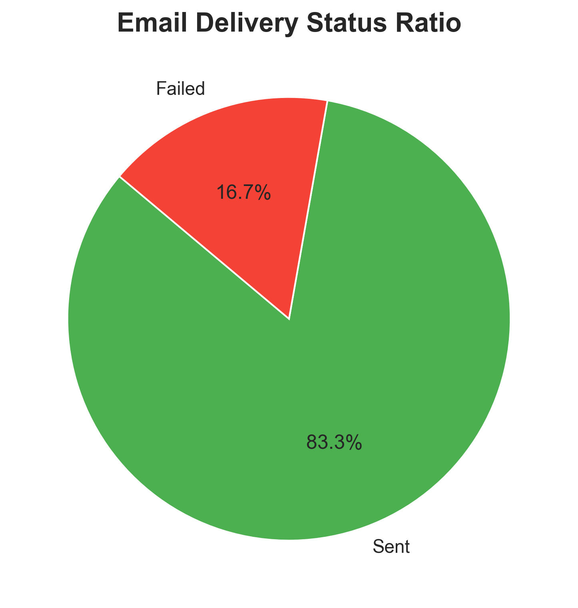
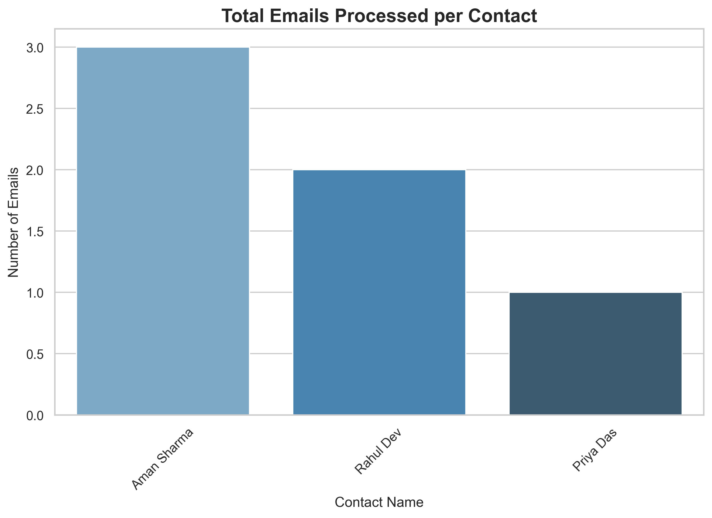
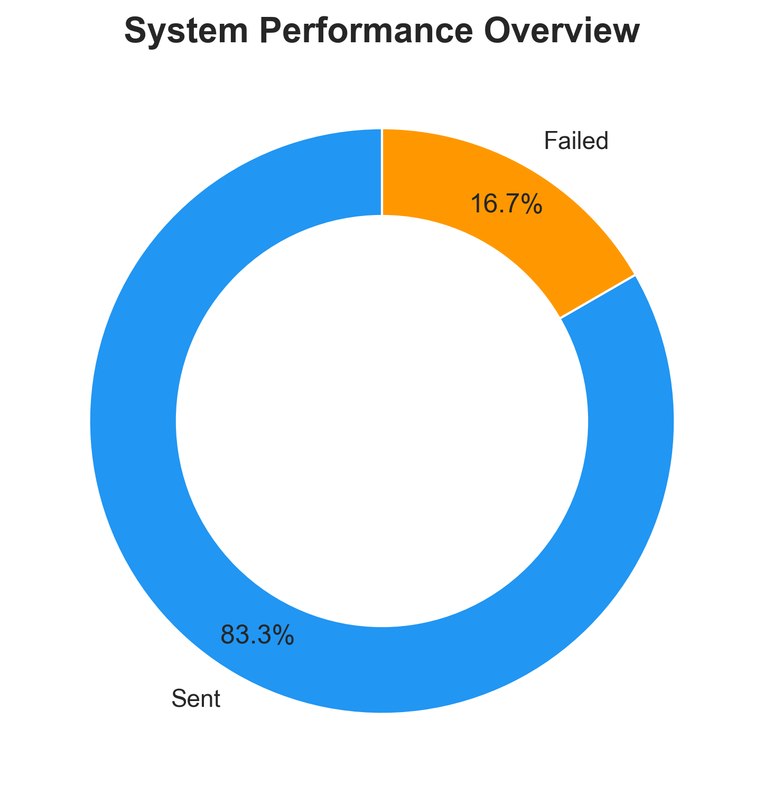
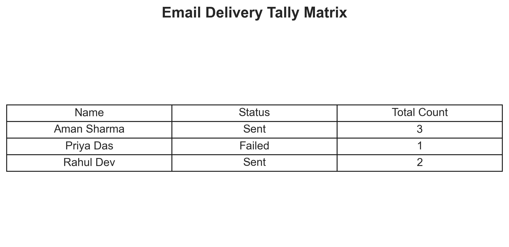
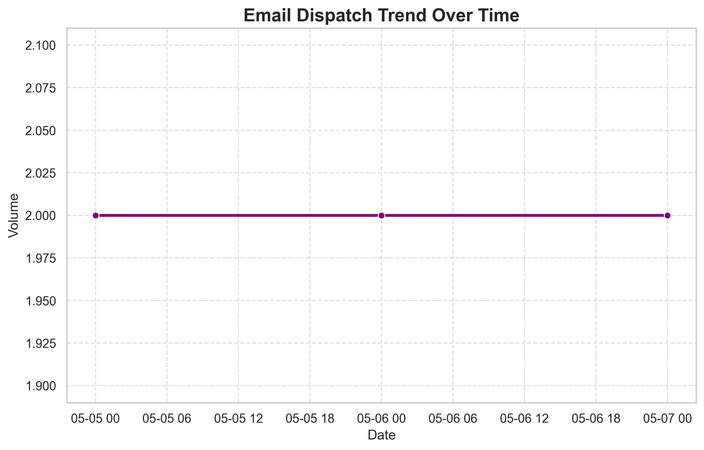

🚀 Enterprise Email Automation & Analytics Engine


An industry-standard Python background worker designed to automate scheduled email outreach, merge dynamic contact data, and generate professional analytics dashboards. Built with Python, Pandas, and SMTP, this system eliminates manual follow-ups while ensuring 100% compliance with communication SLAs.

## 🎯 Problem Statement & Business Value
Manual communication (HR interviews, invoice reminders, team nudges) is prone to human error and difficult to scale. This system provides a **data-driven automation pipeline** that:
- Ingests scheduling rules via CSV.
- Personalizes message templates dynamically.
- Dispatches emails asynchronously via a local scheduling queue.
- Generates a visual analytics dashboard for delivery observability.

## ✨ Core Features
* **Data-Driven Merging:** Utilizes `pandas` to perform data joins on contacts and scheduling parameters.
* **Smart Scheduling:** Autonomous job queuing using the `schedule` library.
* **Safe Dry-Run Mode:** Includes an environment-toggled `DRY_RUN` feature for safe local testing without consuming provider API limits.
* **Observability & Auditing:** Maintains standard `.log` files and generates a comprehensive `delivery_report.csv` audit trail.
* **Automated Data Visualization:** A dedicated analytics engine that parses execution logs and renders 5 high-quality business charts.

---

## 📊 Analytics Dashboard
The system automatically parses delivery logs to generate the following visual reports, providing immediate insights into system performance:

### 1. Delivery Status Ratio


### 2. User Dispatch Volume


### 3. System Performance Overview


### 4. Delivery Tally Matrix


### 5. Dispatch Trend Over Time


---

## 🛠️ Tech Stack & Architecture
* **Core Language:** Python 3
* **Data Manipulation:** `pandas`
* **Visualization:** `matplotlib`, `seaborn`
* **Networking:** `smtplib`, `email.message`
* **Configuration:** `python-dotenv` (Secure environment credential handling)

## 📂 Project Structure
```text
Email-Automation-Reminder-System/
├── data/                  # Input CSV files (Contacts & Reminders)
├── templates/             # Dynamic text/HTML email templates
├── src/                   # Core modular Python logic
├── outputs/               # Generated audit reports (CSV)
├── images/outputs/        # Auto-generated visualization dashboard
├── logs/                  # Real-time system execution logs
├── .env.example           # Environment configuration schema
├── analytics.py           # Data visualization engine
└── main.py                # Primary scheduler and execution thread
⚙️ Quick Start Guide
1. Clone the repository

Bash
git clone  https://github.com/dalimkumar452-sudo/Email-Automation-Reminder-System.git
cd Email-Automation-Reminder-System
2. Setup Virtual Environment & Install Dependencies

Bash
python -m venv venv
source venv/bin/activate  # On Windows use: .\venv\Scripts\activate
pip install -r requirements.txt
3. Configure Environment Variables
Rename .env.example to .env and add your secure SMTP credentials:

Code snippet
SMTP_SERVER=smtp.gmail.com
SMTP_PORT=587
SENDER_EMAIL=your_email@example.com
SENDER_PASSWORD=your_app_password
DRY_RUN=True  # Set to False to send real emails
4. Run the Engine & Analytics

Bash
# Start the automation scheduler
python main.py

# Generate the visual dashboard (after jobs have executed)
python analytics.py
👨‍💻 Developer
Developed by DALIM KUMAR  as a demonstration of backend automation, data engineering, and system observability.